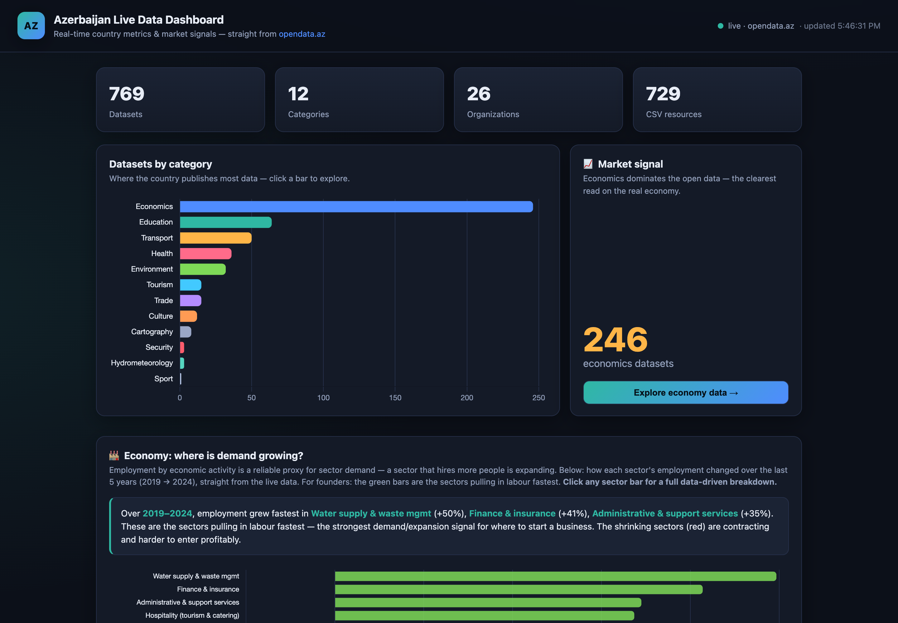
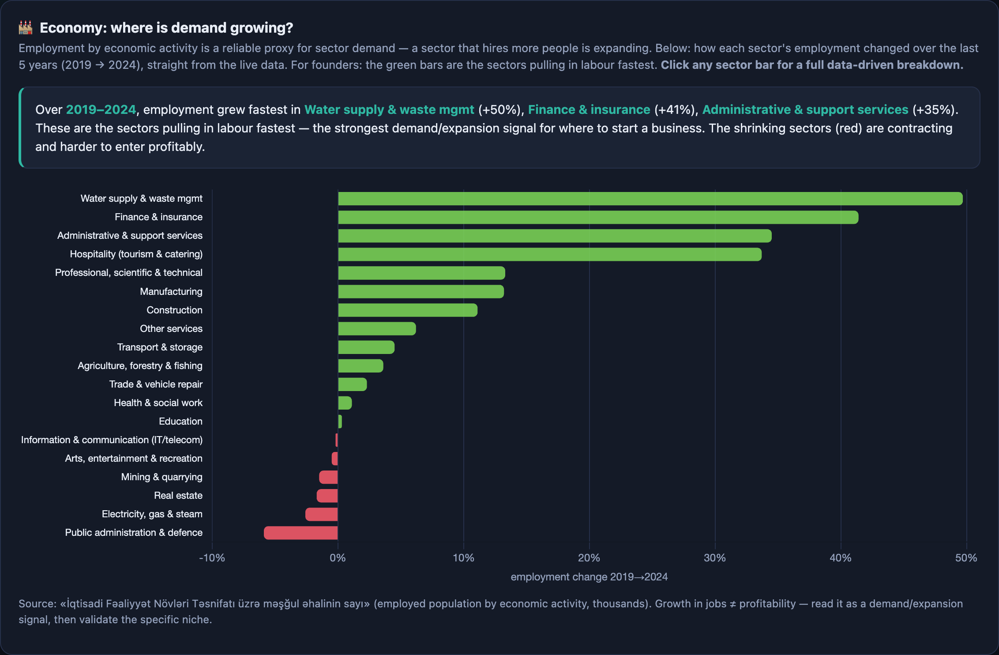
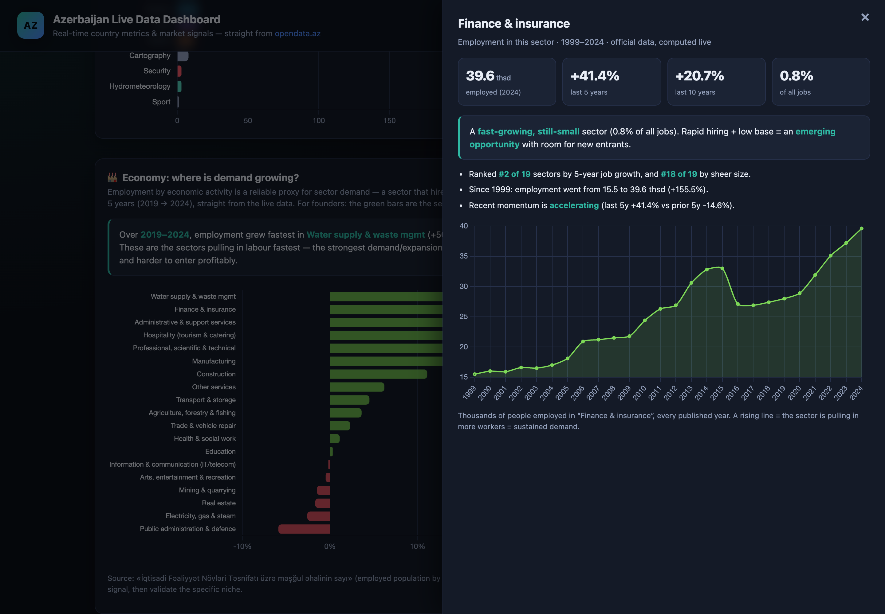

<div align="center">

# 🇦🇿 AzPulse

### Live dashboard over Azerbaijan's national open data

**Real-time country metrics & market-demand signals — built as a static site, no backend, no API key.**

[](https://elkhan-isayev.github.io/azpulse/)
[](https://opendata.az)


**▶ Live demo: https://elkhan-isayev.github.io/azpulse/**

</div>

---

AzPulse reads **769 official government datasets** straight from the CKAN API behind
[opendata.az](https://opendata.az) (the IDDA Open Data Portal) — **live, in the browser**. No server, no
database, no build step. Just open the page and the country's data renders itself.

The headline feature: a panel that answers a real founder's question —
**“which sectors is the economy actually hiring in?”** — and lets you click any sector for a full,
data-driven breakdown.

## 📸 Screenshots

| Overview | Economy — where demand is growing |
|---|---|
|  |  |

| Sector breakdown (click any sector) | Dataset explorer |
|---|---|
|  |  |

## ✨ Features

- **Live KPIs** — datasets, categories, organizations, CSV resources, fetched on every load.
- **Datasets-by-category chart** — click a bar to drill into that sector.
- **🏭 Economy — “where is demand growing?”** — loads the official *employment-by-economic-activity*
  dataset live, computes each sector's 5-year job growth, and ranks them. Green = expanding (demand signal),
  red = contracting. **Click any sector** for a breakdown: 5y/10y growth, share of total employment,
  rank, momentum (accelerating vs. slowing), a full multi-year trend line, and a plain-English verdict.
- **Dataset explorer** — search all 769 datasets, filter by category.
- **Auto-charting + year-over-year** — open any dataset; AzPulse parses its CSV, detects whether it's a
  time series (recognizes a *year column*) and draws a multi-year trend, otherwise a ranked bar chart —
  always with a data table.

## 📊 “Where is demand growing?” — methodology

A practical question for entrepreneurs: **in which sectors is the country adding jobs, and in which is it
shedding them?**

- **Data:** *«İqtisadi Fəaliyyət Növləri Təsnifatı üzrə məşğul əhalinin sayı»* — employed population by
  economic activity (thousands), official, ~1999–2024.
- **Metric:** percent change in employment over the most recent 5-year window, per sector, computed live.
- **Why employment:** a sector that consistently hires more people is expanding and competing for labour —
  one of the cleanest *public* proxies for real, sustained demand (sector-level revenue isn't published).

**Snapshot of what the live data shows (2019 → 2024), fastest-growing first:**

| Sector | Jobs growth |
|---|---|
| Water supply & waste management | ~ +50% |
| Finance & insurance | ~ +41% |
| Administrative & support services | ~ +34% |
| Hospitality (tourism & catering) | ~ +34% |
| Professional, scientific & technical | ~ +13% |
| Manufacturing | ~ +13% |
| Construction | ~ +11% |

> **Read it correctly:** job growth signals *demand and expansion*, not guaranteed profitability. Use it to
> shortlist sectors, then validate the specific niche before committing. The dashboard always recomputes
> from the latest published data.

## 🛠 Tech

Pure static site, zero build step.

- Vanilla JS + [Chart.js](https://www.chartjs.org/) + [PapaParse](https://www.papaparse.com/) (both via CDN).
- Data: CKAN JSON API at `https://admin.opendata.az/api/3/action/package_search`, plus direct CSV downloads.
- The portal serves `Access-Control-Allow-Origin: *`, so the browser can call it directly — no proxy needed.

```
azpulse/
├── index.html            # layout
├── css/styles.css        # styling
├── js/app.js             # CKAN client + charts + economy analysis
├── docs/
│   ├── ARCHITECTURE.md   # how it works under the hood
│   └── screenshots/      # images used in this README
└── .nojekyll             # serve files as-is on GitHub Pages
```

See **[docs/ARCHITECTURE.md](docs/ARCHITECTURE.md)** for how the data pipeline and auto-charting work.

## 🚀 Run locally

No tooling required:

```bash
python3 -m http.server 8080
# open http://localhost:8080
```

## 🌐 Deploy (GitHub Pages)

GitHub Pages serves the `main` branch root. Any push to `main` updates the live site at
**https://elkhan-isayev.github.io/azpulse/** within ~1 minute.

To replicate elsewhere: push the files, then **Settings → Pages → Source: Deploy from a branch →
`main` / root**.

## ⚖️ Data & licensing

All data belongs to the publishing Azerbaijani state bodies and is distributed as open data by the IDDA Open
Data Portal. AzPulse only **fetches and visualizes** that public data — it stores and modifies nothing.

## 🧭 Roadmap

- A daily GitHub Action snapshotting sector-demand rankings into the repo for historical trend lines.
- Cross-dataset comparisons (e.g. exports vs. tourism over time).
- `localStorage` caching of the dataset index for instant repeat loads.

---

<div align="center">
Built by <a href="https://github.com/Elkhan-Isayev">Elkhan Isayev</a> · data from <a href="https://opendata.az">opendata.az</a>
</div>
